# 에이텍모빌리티 자재관리 시스템 — 권한별 사용 가이드

> 본 문서는 **로그인 권한(역할)별로 무엇을 볼 수 있고 무엇을 할 수 있는지**를
> 실제 화면 캡처와 함께 정리한 사용 설명서입니다.
> 화면은 해상도·데이터 상태에 따라 조금씩 다르게 보일 수 있습니다.

---

## 목차

1. [권한(역할) 체계 한눈에 보기](#1-권한역할-체계-한눈에-보기)
2. [로그인 · 회원가입 · 비밀번호 찾기](#2-로그인--회원가입--비밀번호-찾기)
3. [공통 화면 구성 (상단바 · 사이드바)](#3-공통-화면-구성-상단바--사이드바)
4. [대시보드 — 자재현황(전체)](#4-대시보드--자재현황전체)
5. [재고 현황 (입·출고 / 조회)](#5-재고-현황-입출고--조회)
6. [버스단말기 현황](#6-버스단말기-현황)
7. [택시단말기 현황](#7-택시단말기-현황)
8. [센터 단말현황(버스)](#8-센터-단말현황버스)
9. [자재창고 지도 (3D 약도)](#9-자재창고-지도-3d-약도)
10. [입출고 이력 · 사용내역(재고 차감)](#10-입출고-이력--사용내역재고-차감)
11. [자재요청 · 구매요청](#11-자재요청--구매요청)
12. [관리자 전용 — 유저 관리 · 접속 현황](#12-관리자-전용--유저-관리--접속-현황)
13. [공지사항 · 문의하기 · 마이페이지](#13-공지사항--문의하기--마이페이지)
14. [권한별 대표 업무 흐름(시나리오)](#14-권한별-대표-업무-흐름시나리오)

---

## 1. 권한(역할) 체계 한눈에 보기

시스템은 5개 역할로 권한을 구분합니다. 위로 갈수록 권한이 넓습니다.

```
 ┌─────────────────────────────────────────────────────────────┐
 │  admin (관리자)        모든 센터 · 모든 기능 · 유저 관리        │  ▲ 권한 넓음
 ├─────────────────────────────────────────────────────────────┤
 │  materials (자재센터)  전체 재고 열람 · 입출고 · 단말기 업로드   │
 ├─────────────────────────────────────────────────────────────┤
 │  manager (센터 책임)   본인 센터 열람 · 이동신청 승인           │
 ├─────────────────────────────────────────────────────────────┤
 │  user (센터 사용자)    본인 센터 열람 · 사용/이동/자재요청       │
 ├─────────────────────────────────────────────────────────────┤
 │  guest (게스트)        읽기 전용 (재고·이력 조회만)             │  ▼ 권한 좁음
 └─────────────────────────────────────────────────────────────┘
```

> **핵심 개념 ― “센터 기준”**
> `materials`·`admin`은 **모든 센터**의 데이터를 보고 다룰 수 있습니다.
> `manager`·`user`·`guest`는 원칙적으로 **본인 소속 센터**의 데이터만 봅니다.
> 그래서 재고/사용/이동신청의 출발 센터는 항상 본인 센터로 고정되어 안전합니다.

### 1-1. 권한별 메뉴 노출 매트릭스

사이드바에 표시되는 메뉴는 역할에 따라 달라집니다. (`O` = 보임, `–` = 숨김)

| 메뉴 | admin | materials | manager | user | guest |
|------|:--:|:--:|:--:|:--:|:--:|
| 자재현황(전체) — 대시보드 | O | O | O | O | O |
| 버스단말기 현황 | O | O | O | O | O |
| 택시단말기 현황 | O | O | O | O | O |
| 재고 현황 | O | O | O | O | O |
| 센터 단말현황(버스) | O | △¹ | △¹ | △¹ | △¹ |
| 입출고 이력 | O | O | O | O | O |
| 사용내역 이력 | O | O | O | O | – |
| 자재요청현황 | O | O | O | O | – |
| 구매 요청 | O | O | O | O | – |
| 자재창고 지도 | O | O | – | – | – |
| 관리자(유저 관리) | O | – | – | – | – |
| 접속 현황 | O | – | – | – | – |
| 공지사항 / 문의하기 / 마이페이지 | O | O | O | O | O |

> ¹ **센터 단말현황(버스)** 는 소속 센터가 **강남·강서·강북·강동·자재센터** 인 경우에만 보입니다(관리자는 항상 보임).

### 1-2. 권한별 “할 수 있는 일” 매트릭스

| 기능 | admin | materials | manager | user | guest |
|------|:--:|:--:|:--:|:--:|:--:|
| 재고 **입고/출고** 처리 | O | O | – | – | – |
| 재고 **사용**(엑셀 업로드로 차감) | O | O | O | O | – |
| 재고 **이동 신청** | O | O | O | O | – |
| 이동 신청 **승인/거절** | O | O | O² | – | – |
| **자재요청** 작성 | O | O | O | O | – |
| 자재요청 **승인/거절/보류** | O | – | – | – | – |
| **구매요청** 작성 | O | O | O | O | – |
| 구매요청 **상태 변경** | O | – | – | – | – |
| 버스단말기 **출고 업로드 / Teams 알림** | O | O | – | – | – |
| 버스단말기 **입고 업로드 / 인수인계증** | O | O | O³ | O³ | – |
| 택시단말기 **불량입고 / 양품출고 업로드** | O | O | – | – | – |
| 자재 **추가/수정/삭제** (마스터) | O | O⁴ | – | – | – |
| **유저 승인·역할·센터 관리** | O | – | – | – | – |
| 모든 데이터 **조회** | O | O | 본인센터 | 본인센터 | 본인센터 |

> ² 승인은 받는 센터 책임자 기준으로 동작합니다.
> ³ 입고/인수인계증은 게스트를 제외한 전원이 가능하되 **본인 센터 업로드분**만 수정·삭제할 수 있습니다.
> ⁴ 자재 마스터(품목) 수정은 자재센터 권한 범위 내에서 가능합니다.

---

## 2. 로그인 · 회원가입 · 비밀번호 찾기

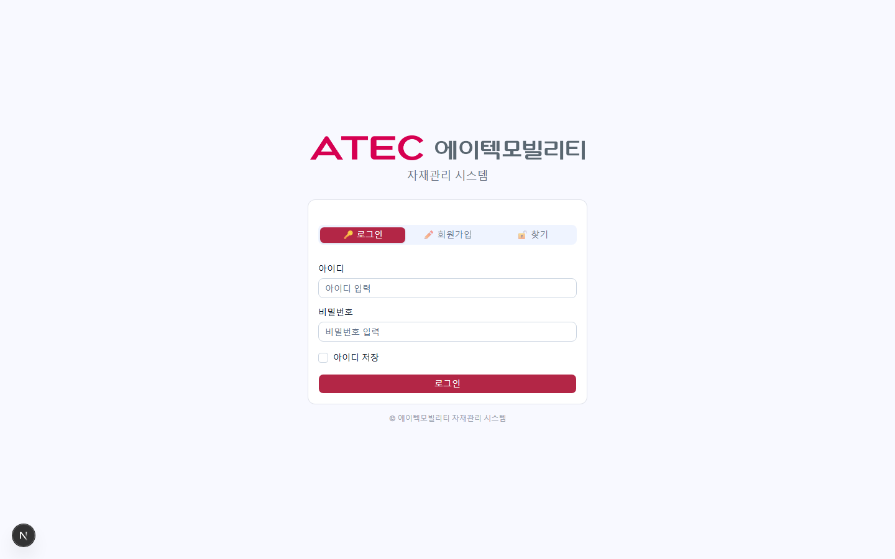

- **🔑 로그인** : 아이디 / 비밀번호 입력 → `로그인`. “아이디 저장”을 체크하면 다음 접속 시 아이디가 자동 입력됩니다.
- **✏️ 회원가입** : 아이디·비밀번호(6자 이상)·이름·회사 이메일·소속 센터를 입력해 신청합니다.
  신청 직후 계정은 **승인 대기(미승인)** 상태이며, **관리자 승인 후**에 로그인할 수 있습니다.
- **🔓 찾기** : 가입 시 등록한 회사 이메일로 **임시 비밀번호**를 발송합니다.

> 장시간(8시간) 활동이 없으면 자동 로그아웃되며, 그 경우 로그인 화면 상단에 안내 문구가 표시됩니다.

---

## 3. 공통 화면 구성 (상단바 · 사이드바)

로그인하면 모든 페이지가 **상단바 + 좌측 사이드바 + 본문**으로 구성됩니다.

**상단바(TopBar)** — 화면 위쪽 가로 막대
- 좌측: `☰` 메뉴 토글, 현재 페이지 제목
- 가운데: **공지 N건**, **처리대기(이동/자재/구매)**, **세션 잔여시간**(30분 미만이면 빨간색)
- 우측: 소속 센터 · 이름 · **권한 배지** · 오늘 날짜, 설정/로그아웃 아이콘

**사이드바(Sidebar)** — 좌측 세로 메뉴 (폭 240px)
- `DASHBOARD / ASSET MANAGEMENT / REQUESTS / UTILITIES` 섹션으로 구분
- 처리 대기 건수는 메뉴 우측 **빨간 배지**로 표시
- 맨 아래 **사용자 카드**에 이름·권한(ADMIN/MATERIALS/MANAGER/USER/GUEST)·센터 표시

같은 화면이라도 **권한에 따라 사이드바 메뉴 수가 달라집니다.** 아래는 동일한 대시보드를 관리자와 센터 사용자가 봤을 때의 비교입니다.

| 관리자(admin) — 모든 메뉴 | 센터 사용자(user) — 축소된 메뉴 |
|---|---|
| 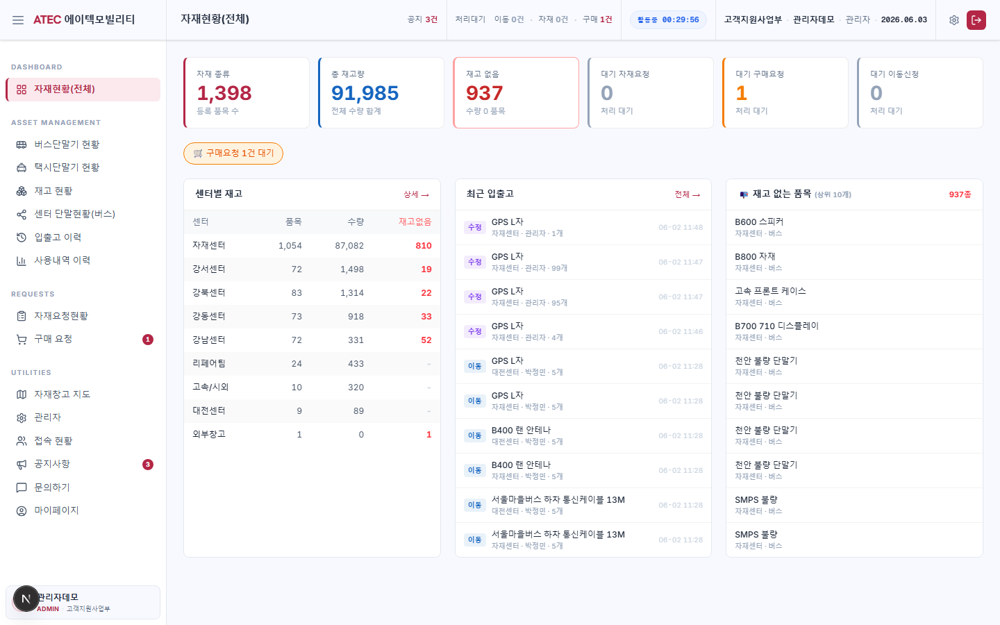 | 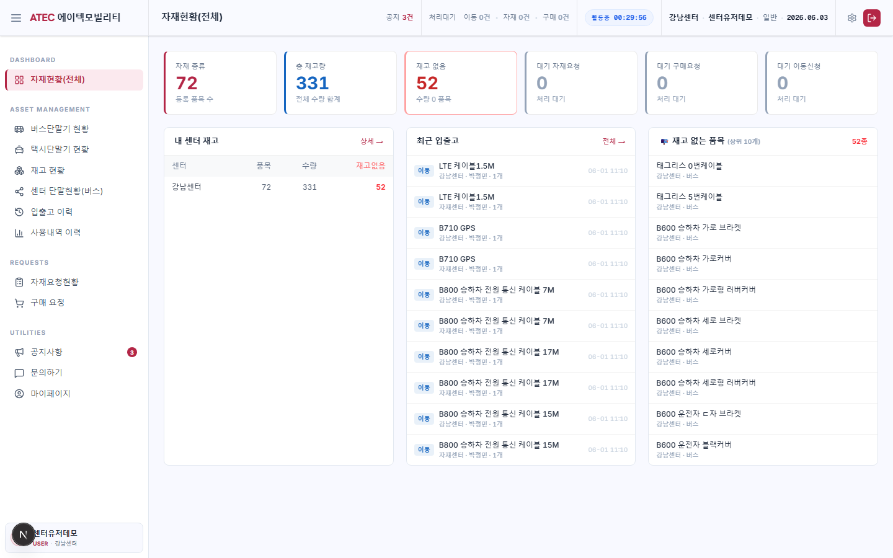 |

> 관리자는 `자재창고 지도 · 관리자 · 접속 현황`이 추가로 보이고, 사용자에게는 보이지 않습니다.
> 게스트는 여기에 더해 `사용내역 이력 · 자재요청 · 구매요청`까지 사라지고 조회 메뉴만 남습니다.

---

## 4. 대시보드 — 자재현황(전체)

모든 권한이 접근할 수 있는 첫 화면입니다. 다만 **집계 범위가 다릅니다.**

### 관리자 / 자재센터 — 전체 센터 집계


- 상단 6개 카드: **자재 종류 · 총 재고량 · 재고 없음 · 대기 자재요청 · 대기 구매요청 · 대기 이동신청**
- **센터별 재고**(전 센터), **최근 입출고**, **재고 없는 품목 Top 10**
- 관리자에게는 미승인 계정/대기 요청 배너가 함께 표시됩니다.

### 센터 사용자 / 매니저 — 본인 센터 집계


- 카드 수치와 “**내 센터 재고**”가 **본인 센터(예: 강남센터)** 기준으로만 계산됩니다.
- 최근 입출고·재고없음 목록도 본인 센터 항목 위주로 표시됩니다.

---

## 5. 재고 현황 (입·출고 / 조회)

`재고 현황` 메뉴는 탭으로 구성됩니다. **탭 개수와 액션 버튼이 권한에 따라 달라집니다.**

### 5-1. 관리자 / 자재센터 — 입·출고 처리 가능
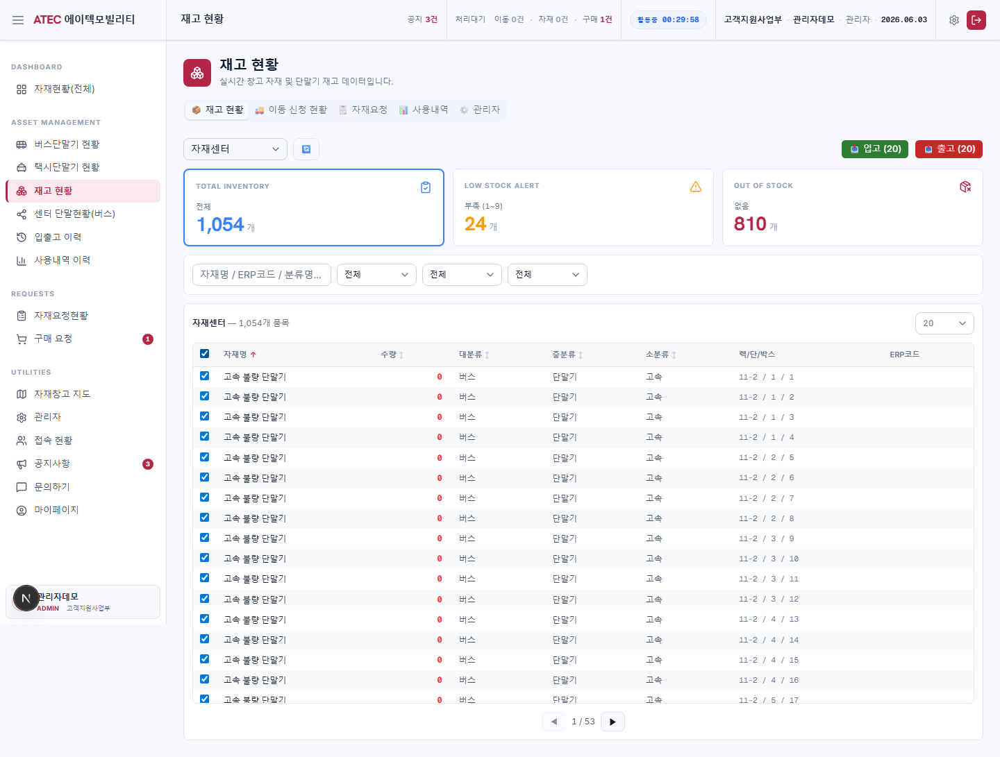

- 탭: **재고 현황 · 이동 신청 현황 · 자재요청 · 사용내역 · 관리자**(관리자만)
- 상단 센터 선택으로 **모든 센터** 재고를 조회할 수 있습니다.
- 표 왼쪽 **체크박스**로 품목을 선택하면 우측 상단에 **📥 입고 / 📤 출고** 버튼이 나타납니다.
- 버튼을 누르면 수량·사유를 입력하는 패널이 열리고, `확정` 시 재고가 증감하며 이력에 기록됩니다.
- KPI 카드(전체 / 부족(1~9) / 재고없음)를 눌러 빠르게 필터링할 수 있습니다.

### 5-2. 센터 사용자 / 매니저 — 조회 + 사용·이동·요청
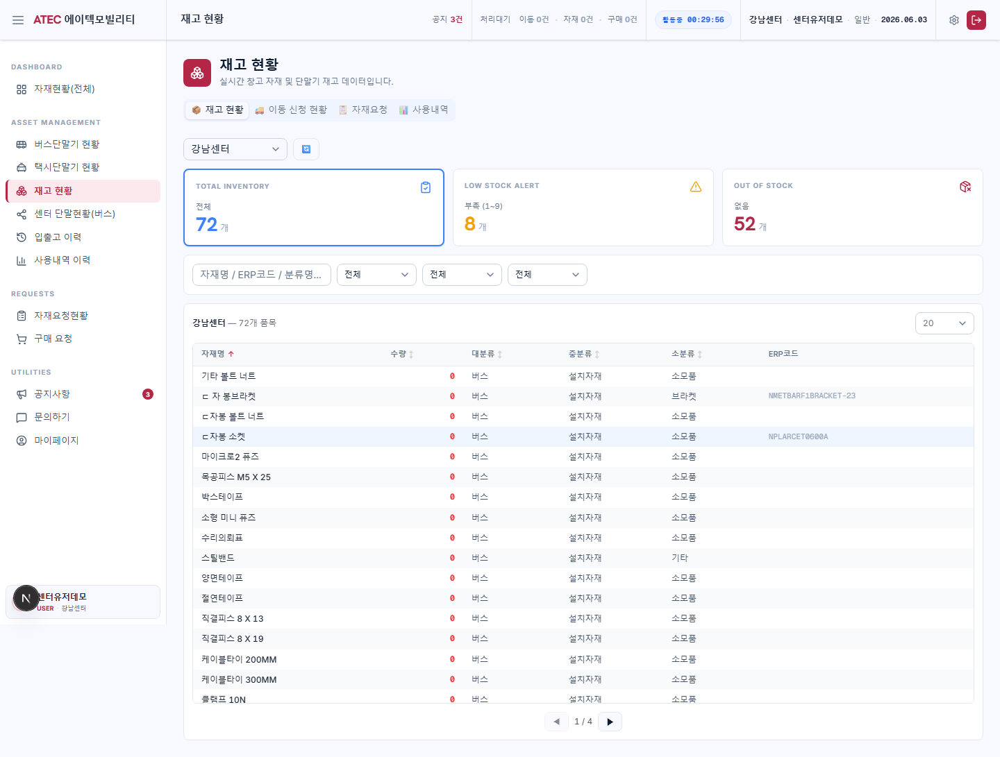

- 센터 선택은 **본인 센터로 고정**되어 다른 센터 재고는 보이지 않습니다.
- 입고/출고 버튼은 없으며, 대신
  - **사용내역** 탭에서 엑셀 업로드로 재고를 차감하고([10장](#10-입출고-이력--사용내역재고-차감)),
  - **이동 신청 현황** 탭에서 다른 센터로의 이동을 신청합니다.
- **자재요청** 탭에서 자재센터에 필요한 품목을 요청할 수 있습니다([11장](#11-자재요청--구매요청)).

### 5-3. 게스트 — 읽기 전용
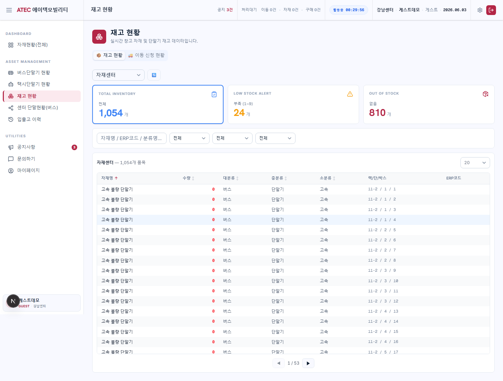

- 탭이 **재고 현황 · 이동 신청 현황** 2개로 줄어듭니다.
- **체크박스·입출고 버튼이 없어** 조회만 가능합니다. (사용내역/자재요청/관리자 탭 숨김)

---

## 6. 버스단말기 현황

티머니(버스) 단말기의 센터 간 출고·입고를 관리하는 화면입니다.
탭: **오늘의 현황 · 월간 현황 · 이력 조회 · 인수인계증**.
**권한에 따라 출고/입고 업로드 가능 여부가 다릅니다.**

### 6-1. 자재센터 / 관리자 — 출고·입고 모두 가능
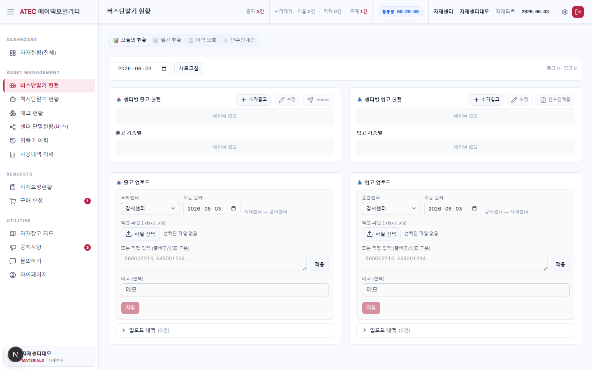

- **출고 현황** 카드 헤더에 **➕ 추가출고 · ✏️ 수정 · 📨 Teams** 버튼
- **입고 현황** 카드 헤더에 **➕ 추가입고 · ✏️ 수정 · 📄 인수인계증** 버튼
- 하단에 **출고 업로드 / 입고 업로드** 패널이 좌우로 나란히 표시됩니다.
- 엑셀 파일(.xlsx) 또는 TRCN_ID 직접 입력으로 업로드하며, **📨 Teams** 로 출고 내역을 팀즈 채널에 알릴 수 있습니다.

### 6-2. 센터 사용자 — 입고만 가능
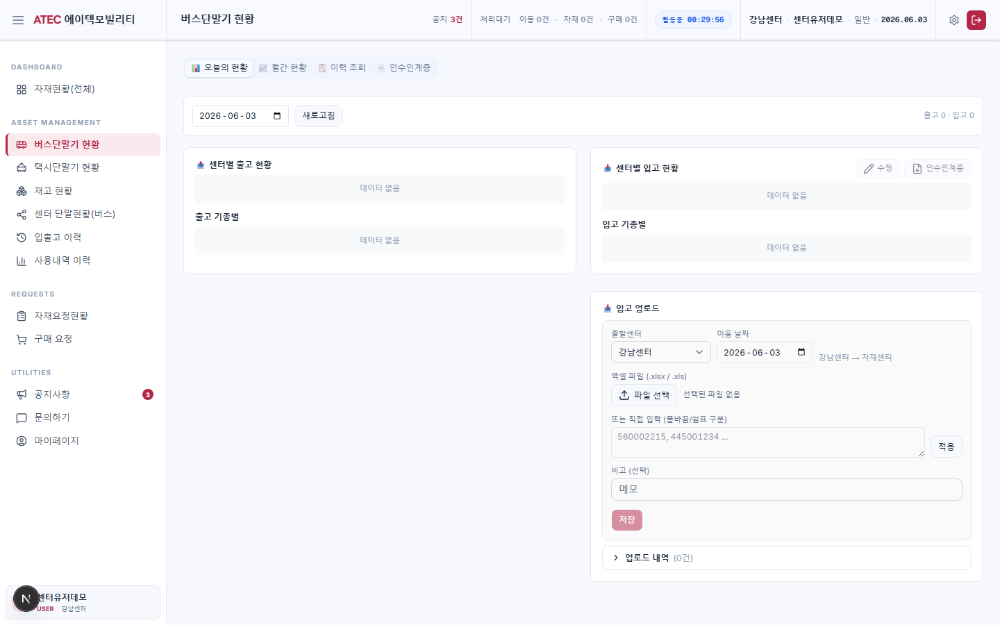

- 출고 권한이 없어 출고 카드에는 빠른 버튼이 보이지 않습니다.
- **입고 업로드 패널만** 우측에 표시됩니다(출발 센터 → 자재센터 흐름).
- 입고 내역 **수정/삭제는 본인 센터 업로드분만** 가능합니다.
- 게스트는 업로드 패널 없이 현황 **조회만** 가능합니다.

> 인수인계증은 서식(테두리·서명란·IH 목록)·로고·페이지 나누기까지 갖춘 엑셀로 내려받을 수 있습니다.

---

## 7. 택시단말기 현황

티머니(택시) 단말기를 **자재센터 허브 단일 흐름**으로 관리합니다.
탭: **현황 · 이력 조회 · 배송 이력**.

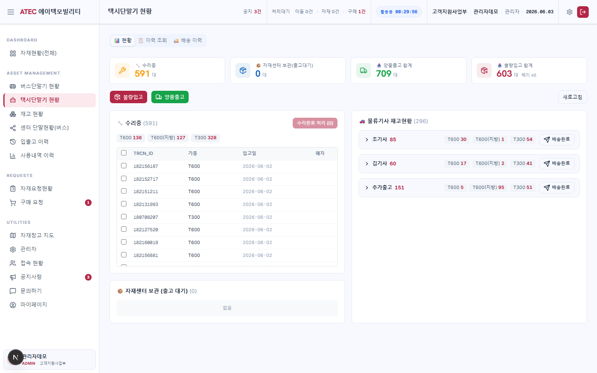

- 상단 메트릭: **수리중 · 자재센터 보관(출고대기) · 양품출고 합계 · 불량입고 합계(해지 포함)**
- 좌측 **수리중 목록**(기종별 T600/T600(지방)/T300), 우측 **물류기사 재고현황**(기사별 보유·배송완료)
- **입·출고 업로드 권한** = `admin` 또는 `자재센터(게스트 제외)`.
  권한이 있으면 상단에 **🟥 불량입고 · 🟩 양품출고** 버튼이 나타납니다.
- **조회는 로그인한 누구나** 가능합니다. 수정/삭제는 자재센터·관리자 또는 본인 업로더만 가능합니다.

> 택시 단말기를 입·출고하면 자재창고 지도의 **단말기 분류 박스**에서 해당 IH가 자동으로 제거됩니다([9장](#9-자재창고-지도-3d-약도)).

---

## 8. 센터 단말현황(버스)

자재센터에서 출고된 단말기를 **직원별로 배정/반납 추적**하는 화면입니다.
이 메뉴는 **강남·강서·강북·강동·자재센터** 소속(또는 관리자)에게만 보입니다.

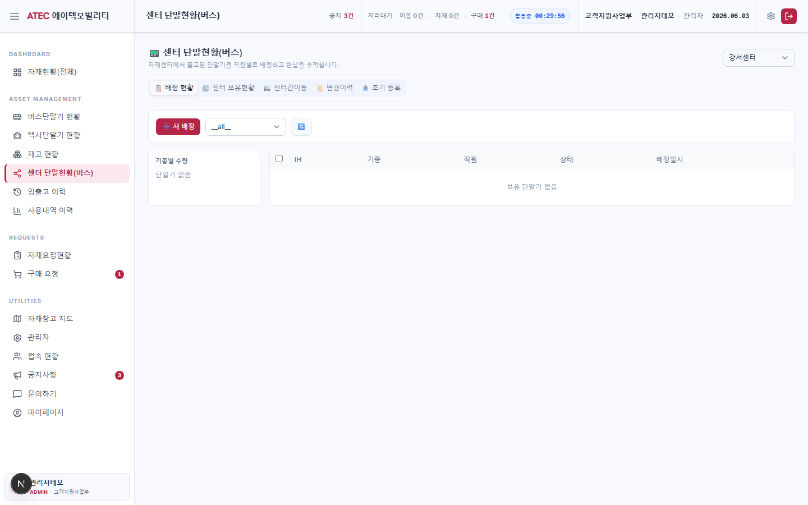

탭 구성:
- **📋 배정 현황** : 직원별 단말기 조회, `➕ 새 배정`, 불량 교체·직원 이동·반납·배정 취소·수정
- **🏢 센터 보유현황** : 직원 × 기종 피벗표, 전체 목록, **🗑️ 데이터 삭제**(관리자·매니저)
- **🚛 센터간이동** : 이동 신청 / 받은 신청 승인·거절 / 이동 이력
- **📜 변경이력** : 날짜·액션 필터, IH·직원명 검색, 📥 엑셀 다운로드
- **📤 초기 등록** : 엑셀 업로드로 초기 배정 일괄 등록

> 우측 상단 센터 선택으로 대상 센터를 바꿀 수 있습니다(관리자). 일반 센터 사용자는 본인 센터 위주로 동작합니다.

---

## 9. 자재창고 지도 (3D 약도)

`자재창고 지도`는 **관리자·자재센터**에게만 보이는 메뉴입니다.
소속이 **자재센터**면 리스트 대신 **3D 약도(floor-plan)** 로 렉 배치를 보여줍니다.

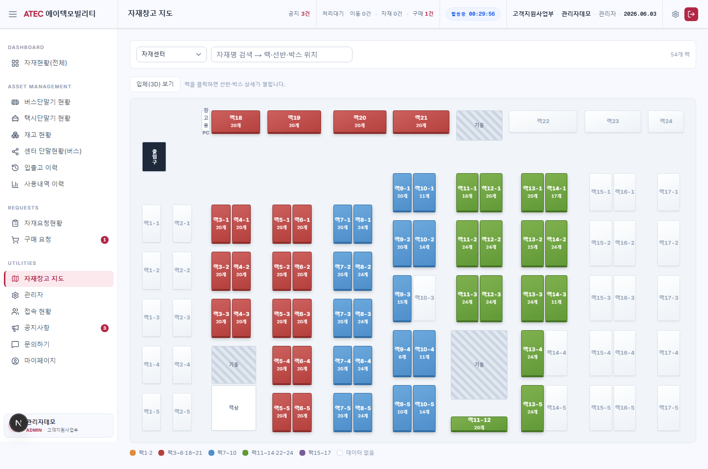

- 색상 블록 = 렉(rack). **렉을 클릭**하면 그 렉의 품목이 **선반·박스 순으로** 정리되어 모달로 표시됩니다.
- “**입체(3D) 보기**” 토글로 평면/입체 전환이 가능합니다.
- **단말기 분류 박스**(중분류 ‘단말기’)에서는 개별 단말기(IH=TRCN_ID + 기종)를 등록·삭제할 수 있습니다(자재센터·관리자).
- 품목 편집(마스터 수정)은 관리자 권한에서 가능합니다.

> 자재센터가 아닌 다른 센터 사용자는 이 메뉴 자체가 보이지 않습니다.

---

## 10. 입출고 이력 · 사용내역(재고 차감)

### 10-1. 입출고 이력
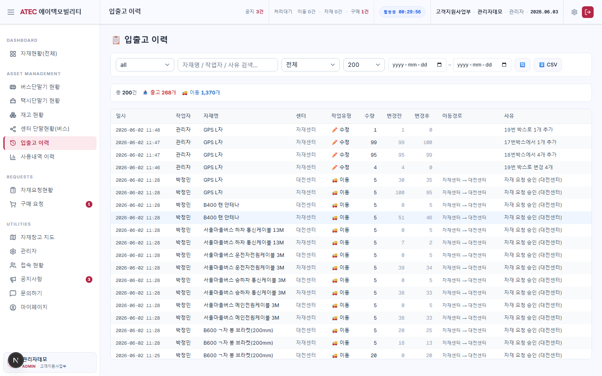

- 날짜 범위 · 센터 · 유형(입고/출고/이동/수정) 필터, 요약 통계, CSV 내려받기
- 관리자/자재센터는 전 센터, 그 외는 본인 센터 이력만 조회됩니다.

### 10-2. 사용내역 — 엑셀 업로드로 재고 차감
**사용내역은 단순 조회가 아니라, 엑셀을 올려서 해당 센터 재고를 일괄 차감하는 기능**입니다.
게스트를 제외한 모든 권한이 사용할 수 있습니다.

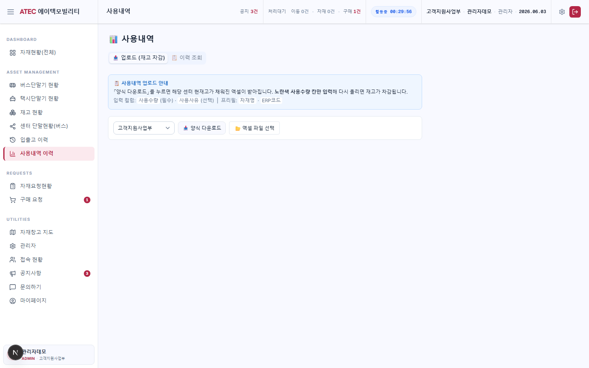

사용 순서:
1. **양식 다운로드** → 해당 센터 현재고가 **자재명·ERP코드까지 채워진** 엑셀이 받아집니다(사용수량 칸은 노란 음영).
2. **사용수량 칸만 입력**한 뒤 다시 업로드 → 미리보기에서 확인
3. **차감 확정** → 재고가 줄고 입출고 이력(출고)으로 기록됩니다. 행별 성공/실패가 표시됩니다.

> 관리자는 상단 센터 선택으로 **다른 센터를 지정**해 차감할 수 있고, 그 외 권한은 **본인 센터에서만** 차감됩니다.

---

## 11. 자재요청 · 구매요청

### 11-1. 자재요청 — 작성(전원) / 승인(관리자)

**센터 사용자 화면 — 새 요청 작성**
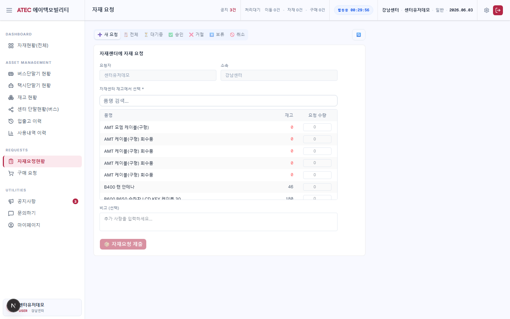

- `➕ 새 요청` 탭에서 자재센터 재고 목록을 보고 **요청 수량**을 입력해 제출합니다.
- 요청자·소속은 로그인 정보로 자동 채워집니다.

**관리자 화면 — 검색 / 승인·거절·보류**
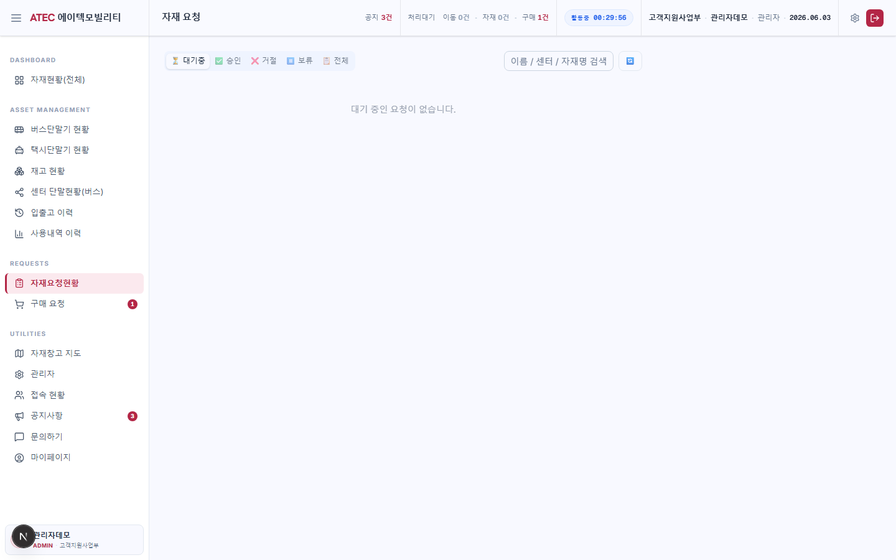

- 관리자는 전체 요청을 상태별(대기중/승인/거절/보류/취소)로 조회하고 처리합니다.
- 승인/거절/보류 시 **신청자에게 이메일 알림**이 발송됩니다.

### 11-2. 구매요청 — 작성(전원) / 상태 변경(관리자)
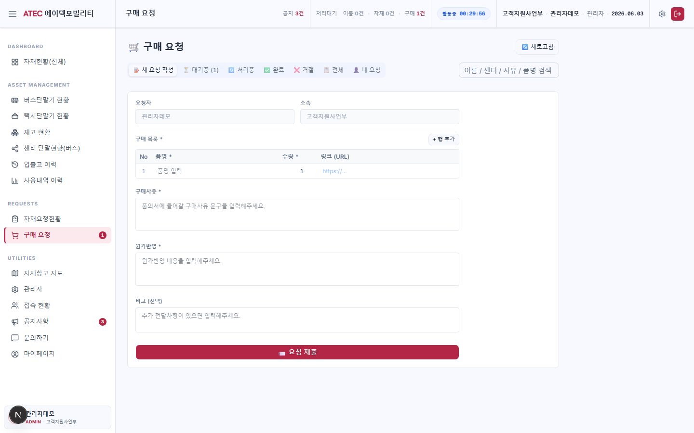

- 게스트를 제외한 누구나 구매요청을 작성할 수 있습니다.
- 관리자가 상태(진행/완료/거절)를 변경하면 신청자에게 이메일이 발송됩니다.
- 새 구매요청이 제출되면 관리자·자재센터에게 알림 메일이 갑니다.

---

## 12. 관리자 전용 — 유저 관리 · 접속 현황

아래 두 메뉴는 **관리자(admin)에게만** 보입니다.

### 12-1. 관리자 — 유저 관리
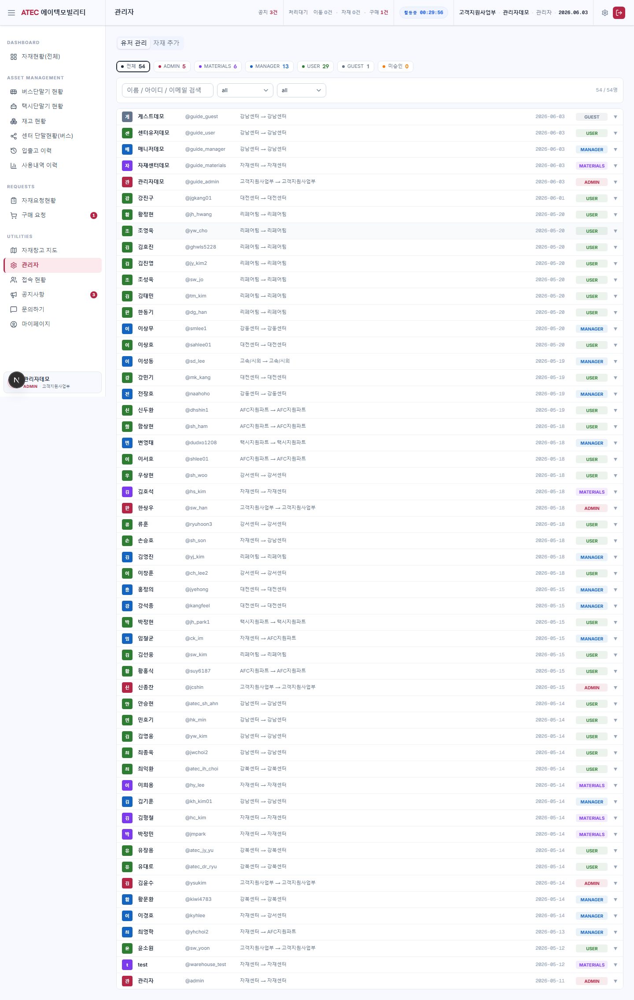

- 가입 신청 **승인 / 전체 승인**, **역할 변경**(admin·materials·manager·user·guest), **소속 센터 변경**
- 자재(품목) **추가** 기능 포함
- 처리 시 토스트로 결과를 알려줍니다.

### 12-2. 접속 현황
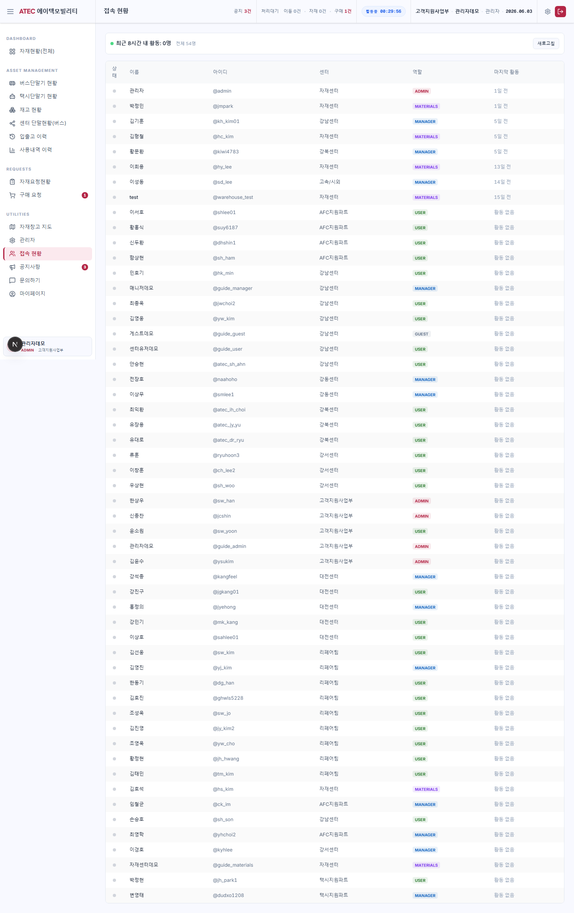

- 최근 활동(last active) 기준으로 사용자 접속 상태를 확인합니다.

---

## 13. 공지사항 · 문의하기 · 마이페이지

모든 권한이 접근할 수 있는 공통 유틸리티입니다.

### 공지사항
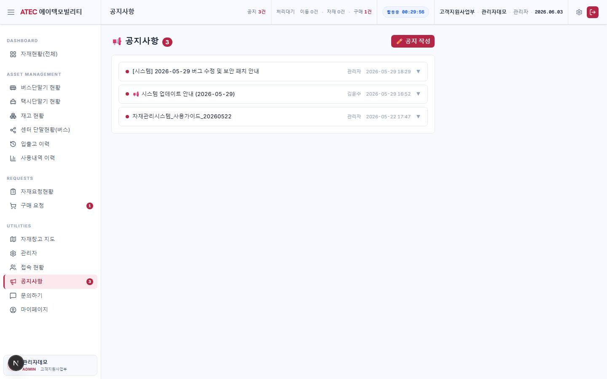
- 작성/수정/삭제는 **관리자**, 그 외 권한은 **읽기**(읽음 상태 표시). 미읽음 수는 사이드바 배지로 표시됩니다.

### 문의하기
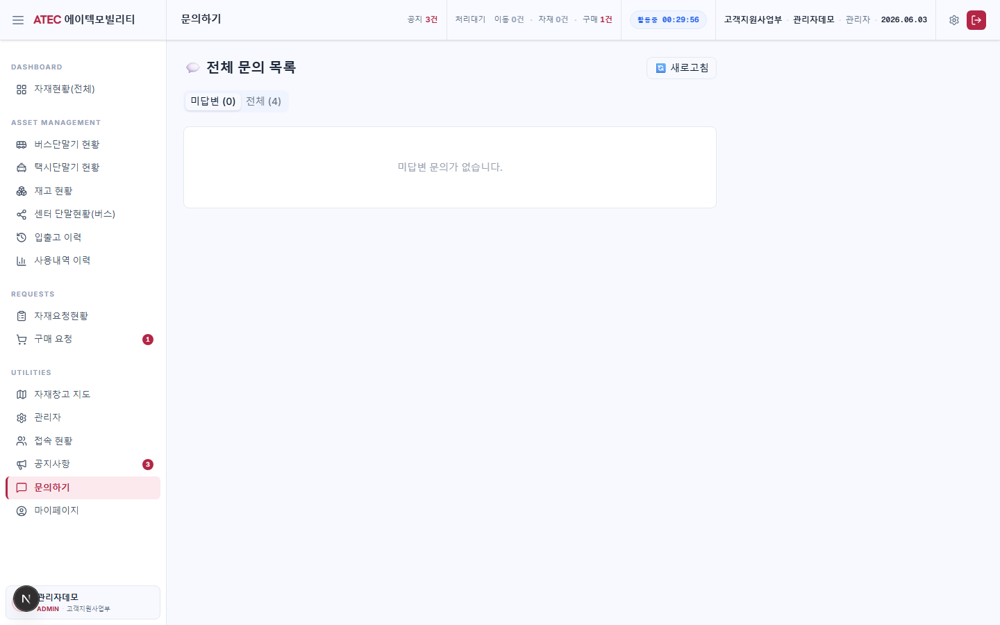
- 누구나 문의를 등록할 수 있고, **관리자가 답변**하면 문의자에게 이메일이 발송됩니다.

### 마이페이지
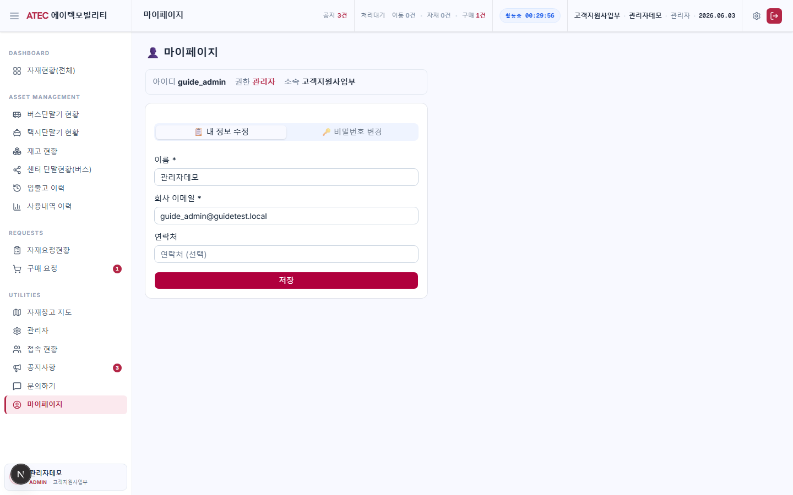
- 내 정보(연락처 등) 수정과 **비밀번호 변경**을 할 수 있습니다.

---

## 14. 권한별 대표 업무 흐름(시나리오)

**🟥 관리자(admin)**
1. 가입 신청 들어옴 → `관리자` 메뉴에서 **승인 + 역할/센터 지정**
2. 대기 중인 자재요청/구매요청 → 검토 후 승인·상태변경(이메일 자동 발송)
3. 필요 시 모든 센터 재고를 직접 입·출고, 자재 마스터 추가/수정

**🟧 자재센터(materials)**
1. `버스/택시 단말기 현황`에서 **출고/입고 엑셀 업로드** + Teams 알림
2. `재고 현황`에서 입·출고 처리, `자재창고 지도`로 렉·단말기 박스 관리
3. 각 센터의 자재요청에 대응(품목 출고)

**🟨 매니저(manager)**
1. 본인 센터 재고/단말기 현황 모니터링
2. 받은 **이동 신청 승인/거절**, 센터 단말기 배정 관리
3. 필요 자재는 **자재요청**으로 자재센터에 요청

**🟩 센터 사용자(user)**
1. `사용내역`에서 양식 다운로드 → 사용수량 입력 → 업로드로 **재고 차감**
2. 다른 센터로 필요 시 **이동 신청**, 부족 품목은 **자재요청**
3. 버스 단말기 **입고 업로드** + 인수인계증 출력

**⬜ 게스트(guest)**
1. 재고 현황·입출고 이력 **조회**
2. 공지 확인·문의 등록만 가능(데이터 변경 불가)

---

### 부록 — 화면 빠른 참조

| 하고 싶은 일 | 메뉴 | 가능 권한 |
|---|---|---|
| 전체 재고 한눈에 보기 | 자재현황(전체) | 전원 |
| 재고 입고/출고 | 재고 현황 → 체크박스 → 입고/출고 | admin · materials |
| 사용한 자재 차감 | 사용내역 → 양식/업로드 | guest 제외 |
| 다른 센터로 이동 | 재고 현황 → 이동 신청 | guest 제외 |
| 자재 요청하기 | 자재요청현황 → 새 요청 | guest 제외 |
| 단말기 출고/Teams | 버스단말기 현황 | admin · materials |
| 단말기 입고/인수인계증 | 버스단말기 현황 | guest 제외 |
| 택시 불량입고/양품출고 | 택시단말기 현황 | admin · 자재센터 |
| 직원별 단말기 배정 | 센터 단말현황(버스) | 해당 센터 · admin |
| 렉/단말기 박스 관리 | 자재창고 지도 | admin · materials |
| 유저 승인·권한 변경 | 관리자 | admin |

---

*© 에이텍모빌리티 자재관리 시스템 — 본 가이드의 화면은 데모 계정으로 캡처되었습니다.*
